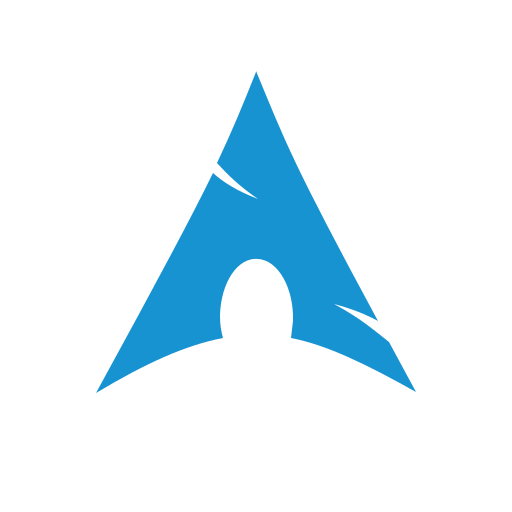

# Hi there! I'm Muhammad Razfaziya :wave:


[](https://github.com/VeonN4)
[](https://www.veonise.my.id)
[](https://wakatime.com/@22d3828d-610f-4f85-b24a-0d576a94c872)

A student at **SMKN 1 Cianjur** and someone who dreamed of being a **Software Engineer / AI Engineer**

Currently interning as Full-Stack Developer at **Mobilus Interactive** for 3-months.

<br>
    
> [!IMPORTANT]
> Learn more about my journey [here](https://veonise.my.id "My personal website")...

<br>

<h2 align="left" id="tech">Tech</h2>

> Language I'm currently focused on

<table>
  <tr>
    <td align="center" width="96">
      <a href="#homepage">
        
      </a>
      <br>Python
    </td>
    <td align="center" width="96">
      <a href="#homepage">
        
      </a>
      <br>JavaScript
    </td>
  </tr>
</table>

> Things I use...

<table>
  <tr>
    <td align="center" width="96">
      <a href="#homepage">
        
      </a>
      <br>Arch btw
    </td>
    <td align="center" width="96">
      <a href="#homepage">
        
      </a>
      <br>Windows
    </td>
    <td align="center" width="96">
      <a href="#homepage">
        
      </a>
      <br>VSCode
    </td>
  </tr>
</table>

## ⌚ Playtime

<!--START_SECTION:waka-->


📊 **This Week I Spent My Time On** 

```text
🕑︎ Time Zone: Asia/Jakarta

💬 Programming Languages: 
TypeScript               5 hrs 50 mins       █████████████░░░░░░░░░░░░   53.37 % 
PHP                      1 hr 34 mins        ████░░░░░░░░░░░░░░░░░░░░░   14.33 % 
Markdown                 1 hr 2 mins         ██░░░░░░░░░░░░░░░░░░░░░░░   09.45 % 
Bash                     40 mins             ██░░░░░░░░░░░░░░░░░░░░░░░   06.16 % 
Blade Template           31 mins             █░░░░░░░░░░░░░░░░░░░░░░░░   04.76 % 

🔥 Editors: 
Neovim                   10 hrs 13 mins      ███████████████████████░░   93.40 % 
Antigravity CLI          39 mins             ██░░░░░░░░░░░░░░░░░░░░░░░   06.04 % 
Claude Code              3 mins              ░░░░░░░░░░░░░░░░░░░░░░░░░   00.56 % 

🐱‍💻 Projects: 
link-shortener           4 hrs 36 mins       ███████████░░░░░░░░░░░░░░   42.09 % 
report_app               3 hrs 7 mins        ███████░░░░░░░░░░░░░░░░░░   28.51 % 
Unknown Project          2 hrs 16 mins       █████░░░░░░░░░░░░░░░░░░░░   20.79 % 
smkn1-katapang           45 mins             ██░░░░░░░░░░░░░░░░░░░░░░░   06.95 % 
report_app_new           10 mins             ░░░░░░░░░░░░░░░░░░░░░░░░░   01.66 % 

💻 Operating System: 
Linux                    10 hrs 56 mins      █████████████████████████   100.00 % 
```

🤖 **AI Coding This Week** 

```text
⏱ AI Coding Time: 4 hrs 28 mins (40.89%)

✍️ 7,409 lines written by AI, 774 lines written by hand (90.54% AI-written)

🔤 1,666,076 Input Tokens, 101,842 Output Tokens

💵 $6.53 Estimated AI Cost This Week

🧠 24 AI Sessions, 56 AI Prompts

Mimo                     4,103 lines         ██████████████░░░░░░░░░░░   54.79 % 
Deepseek                 3,192 lines         ███████████░░░░░░░░░░░░░░   42.63 % 
Gemini                   193 lines           █░░░░░░░░░░░░░░░░░░░░░░░░   02.58 % 
Opencode-Cli             0 lines             ░░░░░░░░░░░░░░░░░░░░░░░░░   00.00 % 

🔎 AI Coding Insights:
🤖 AI-Driven — 90.54% of written lines came from AI
📚 Verbose Prompter — average 9,521 characters per prompt
🔁 Iterative Prompter — average 2 prompts per session
🚀 High AI Trust — 11.7% of changed lines were hand-edited
```

**I Mostly Code in TypeScript** 

```text
TypeScript               12 repos            ███████░░░░░░░░░░░░░░░░░░   29.27 % 
Blade                    4 repos             ██░░░░░░░░░░░░░░░░░░░░░░░   09.76 % 
PHP                      4 repos             ██░░░░░░░░░░░░░░░░░░░░░░░   09.76 % 
Dart                     3 repos             ██░░░░░░░░░░░░░░░░░░░░░░░   07.32 % 
Astro                    1 repo              █░░░░░░░░░░░░░░░░░░░░░░░░   02.44 % 
```


 Last Updated on 29/07/2026 19:50:05 UTC
<!--END_SECTION:waka-->

---

> *I'm way too lazy to make this good.*
